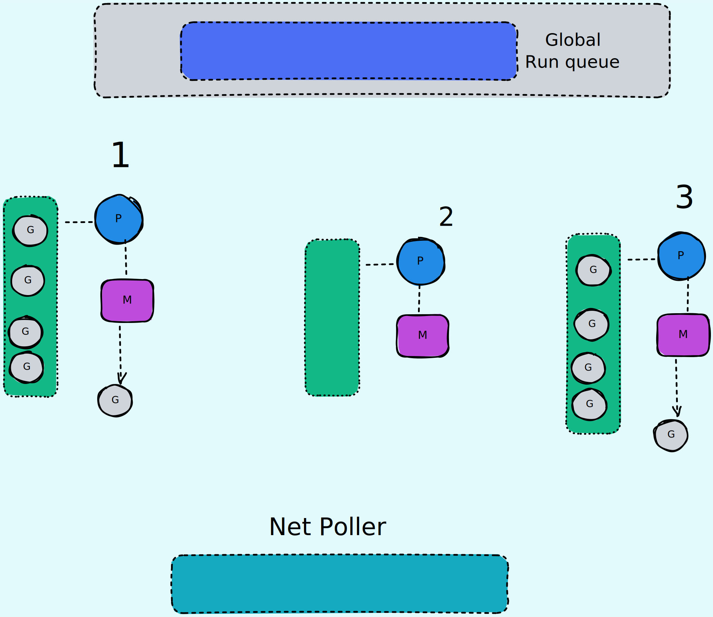

# Строки

```go
type string struct {
    str unsafe.Pointer // pointer to first byte
	len int
}
```

```go
nil string = ""
```


```go
// for range по рунам
string := "привет"
for i, rune := range(string)
```

```
L = 1 байт
Д = 2 байта
大 = 3 байта
😀 = 4 байта
```
</br>

Определение кол-ва байт происходит по **битам** первого **байта**

| Кодировка UTF-8 |              |          |          |           |
|---------------- |------------- |--------- |--------- |---------- |
| 1 байт          | **0**xxxxxxx |          |          |           |
| 2 байта         | **110**xxxxx | 10xxxxxx |          |           |
| 3 байта         | **1110**xxxx | 10xxxxxx | 10xxxxxx |           |
| 4 байта         | **11110**xxx | 10xxxxxx | 10xxxxxx | 10xxxxxx  |

</br>

# Слайсы

```go
type slice struct {
    // pointer to first element of
    // the underlying array
    array unsafe.Pointer // nil in nil
    len int              // 0 in nil
    cap int              // 0 in nil
}
```

### Формула append
```go
(oldcap + 3 * 256) / 4
```
</br>

# Интерфейсы
```go
// normal
type iface struct {
    tab  *itab
    data unsafe.Pointer
}

// empty
type eface struct {     // interface{1}
    _type *_type        // int
    data  unsafe.Pointer// 1
}

Сложность приведения типа к интерфейсу O(n*m)

type itab struct {
    inter *interfacetype
    _type *_type
    hash  uint32
    _     [4]byte
    fun   [1]uintptr // in runtime becomes [n]uintptr, n = num of a type's methods
}
```

# Мапы:
    чтение из nil -> zero value
    запись в nil -> паника

    Порядок элементов во время итерации по мапе не гарантирован.
    Но, при использовании fmt.Println идёт сортировка по ключу.

# Типы конкурентности:
        кооперативная       (горутины общаются между собой)
        вытесняющая         (планировщик/компилятор)
        неявно вытесняющая  (Go)

# Функции и горутины

### Области видимости:
        У каждой функции
        У каждого замыкания
        Отдельный скоуп {}

    Отдельная область видимости используется для AST оптимизации.
    Бюджет инлайна = 80.


### Escape analisys:
        Heap:
            возврат указателя на локальную переменную
            пустой интерфейс interface{}
            локальная переменная > размер стека функции
        Stack:
            возврат обычной переменной


### Когда можно приостановить горутину?
        safe point - компилятор
        при асинхронном сисколле
        каждые 10ms

### Стековый фрейм:
        Аргументы функции
        Локальные переменные
        Адрес возврата функции

### Стек горутины:
        Когда расширяется стек горутины:
            Когда в функции идёт вызов другой функции
            С помощью пролога определяется размер её стека
            Если размер стека этой функции выходит за лимит стека вызывающей
            Происходит расширение стека

        До Go 1.4 - Split Stack:
            Выделяется новый стек и горутина прыгает между старым и новым
        После - Contiguous Stack:
            Выделяется новый стек (больше или меньше)
            В горутине ставится флаг gcopystack
            Копируются данные
            Переносятся указатели
            GC удаляет старый стек

        Размер стека горутины вычисляется в рантайме
        файл runtime/proc.go -> newproc(*func)

        Размер стека горутины:
            2kb -> 1gb   (64bit)
            2kb -> 250mb (32bit)
            Переключение - 40-100 тактов CPU

        Размер стека треда ОС:
            1mb -> 8mb   (Зависит от архитектуры, битности и т.д.)
            Переключение - 1000 тактов CPU

        Типы аллокаторов:
            Tiny  (< 16 B and no pointers)
            Small (< 32 kB)
            Large (> 32 kB)

### Хеширование функций

Hash(func name, args types, return types)

</br>

# Garbage Collector
        Когда вызывается GC:
            Каждые 2 минуты
            Вручную

        Как расчитывается новый лимит хипа:
            новый лимит = хип + (хип + кол-во чёрных объектов) * GOGC / 100

</br>

# Планировщик



    GoMaxProcs - максимальные кол-во процессоров
    Если поставить выше макс кол-ва ядер ОС,
    то будет конкурентность вместо параллелизма
    из-за постоянной смены контекста

    Процессор -> Машина (Тред ОС) -> Горутины

    Порядок действий процессора:
        Проверка локальной очереди
        Проверка глобальной очереди (каждый 61 тик если локальная очередь не пустая)
        Work Stealing

    Processors (GOMAXPROCS):
        Local Queue
    Net Poller:
        Файловые дескрипторы

    Что происходит при асинхронном сисколле:
        Горутина снимается с машины и ставится на паузу
        Попадает в NetPoller (очередь)
        NetPoller опрашивает epoll (отдельный процесс системы)
        epoll проходится по файловым дескрипторам
        При получении данных ставится флаг записи в сокет
        epoll сообщает NetPoller'у о записи
        Горутина кидается в глобальную очередь
        Попадает в машину и вычитывает данные
        Сбрасывается флаг о данных в сокете (вычитать сокет можно только 1 раз)

    Что происходит при синхронном (блокирующем) сисколле:
        Просим из тред пула машину
        Если её нет, но просим ОС выделить новую машину (тред)
        Процессор переключается на новую машину вместе с локальной очередью
        Старая машина продолжает выполнение горутины
        После выполнения машина кидается в тред пул
        А горутина в глобальную очередь

</br>

# Утечки памяти и CPU

### Память
    Утечка горутины (не закрыли канал)
    Бесконечная запись в глобальные переменные
    CGO - выключает GC

    При асинхронных сисколлах
    При дропе соединения не будет записи в сокет
    Горутина останется в очереди навсегда
    Каждая горутина - память

### CPU
    Если не закрывать файловый дескриптор
    При каждом чтении/записи выделяется новая машина
    Переключение между ними медленное
    Очередь опроса epoll растёт бесконечно
    Потребляется больше и больше CPU

# Память
    Arena -> Object Class -> Spans -> Pages
    Arena:
        64mb (linux)
        4mb  (other)

# OSI

| Уровни        	| Данные   	| Функции                                                  	              | Протоколы            	|
|---------------	|----------	|------------------------------------------------------------------------ |----------------------	|
| Физический    	| Биты     	| Передача двоичных<br>данных                              	              | Bluetooth, WiFi      	|
| Канальный     	| Фреймы   	| Физическая адресация                                     	              | Ethernet, MAC        	|
| Сетевой       	| Пакеты   	| Определение маршрута<br>Логическая адресация            	              | IP                  	|
| Транспортный  	| Сегменты 	| Прямая связь между<br>конечными пунктами<br>и надёжность<br>Буферизация | TCP, UDP, Порты      	|
| Сеансовый     	| Данные   	| Управление сеансом связи                                 	              | gRPC                 	|
| Представления 	| Данные   	| Представление и<br>шифрование данных                     	              | ASCII, SSL, gzip     	|
| Прикладной    	| Данные   	| Доступ к сетевым службам                                 	              | HTTP, FTP, Websocket 	|

</br>

# Примитивы синхронизации:

* Каналы
* sync.Pool
* sync.WaitGroup
* sync.Atomic
* sync.Mutex
* sync.RWmutex
* sync.Cond

</br>

# Каналы
### "4 Аксиомы"
        Closed:
            read:  value -> zero value
            write: panic
        Nil:
            read:  deadlock
            write: deadlock

</br>
